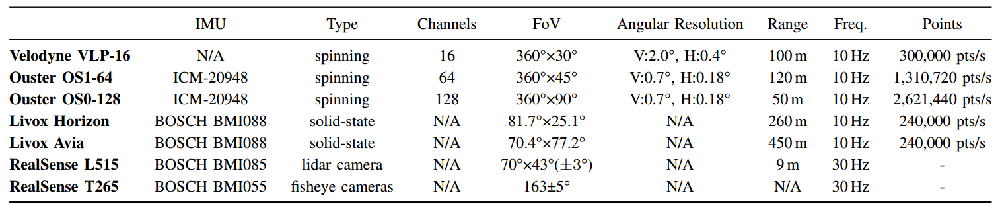

## Benchmark for Multi-Modal Lidar SLAM with Ground Truth

Welcome to TIERS lidars enhanced dataset! 

<div align=center>


</div>
<p align="left">(Left)Ground truth map for one of the indoor sequences generated based on the proposed approach (SLAM-assisted ICP-based prior map). This enables benchmarking of lidar odometry and mapping algorithms in larger environments where a motion capture system or similar is not available, with significantly higher accuracy than GNSS/RTK solutions.</p>


## ABSTRACT:

Lidar-based simultaneous localization and mapping (SLAM) approaches have obtained considerable success in autonomous robotic systems. This is in part owing to the high-accuracy of robust SLAM algorithms and the emergence of new and lower-cost lidar products. This study benchmarks current state-of-the-art lidar SLAM algorithms with a multi-modal lidar sensor setup showcasing diverse scanning modalities (spinning and solid-state) and sensing technologies, and lidar cameras, mounted on a mobile sensing and computing platform. We extend our previous multi-modal multi-lidar dataset with additional sequences and new sources of ground truth data. Specifically, we propose a new multi-modal multi-lidar SLAM-assisted and ICP-based sensor fusion method for generating ground truth maps. With these maps, we then match real-time pointcloud data using a natural distribution transform (NDT) method to obtain the ground truth with full 6 DOF pose estimation. This novel ground truth data leverages high-resolution spinning and solid-state lidars. We also include new open road sequences with GNSS-RTK data and additional indoor sequences with motion capture (MOCAP) ground truth, complementing the previous forest sequences with MOCAP data. We perform an analysis of the positioning accuracy achieved with ten different SLAM algorithm and lidar combinations. We also report the resource utilization in four different computational platforms and a total of five settings (Intel and Jetson ARM CPUs). Our experimental results show that current state-of-the-art lidar SLAM algorithms perform very differently for different types of sensors.

Keywords: Lidar, Dataset, Multi-modal, Multi-scenario, SLAM, Solid-state lidarsAutonomous driving, LiDAR SLAM benchmark solid-state LiDAR, SLAM

## MAIN CONTRIBUTIONS: 

   *    a ground truth trajectory generation method for environments where MOCAP or GNSS/RTK are unavailable that leverages the multi-modality of the data acquisition platform and high-resolution sensors;% by solid-state lidar with a Non-repetitive scanning pattern and high-resolution spinning lidar.

   *    a new dataset with data from 5 different lidar sensors, one lidar camera, and one stereo fisheye cameras in a variety of environments as illustrated in Fig.~\ref{fig:hardware_cfg}. Ground truth data is provided for all sequences; and


   *    the benchmarking of ten state-of-the-art filter-based and optimization-based SLAM methods on our proposed dataset in terms of the accuracy of odometry, memory and computing resource consumption. The results indicate the limitations of current SLAM algorithms and potential future research directions.


## Updates 

2022.09.20   Initial dataset upload
 

## 1. LICENSE

This work is licensed under the MIT license and is provided for academic purpose. Please contact us at qingqli@utu.fi for further information.  

 
## 2. SENSOR SETUP

### 2.1 Sensor parameters
Sensor specification for the presented dataset. Angular resolution is configurable in the OS1-64 (varying the vertical FoV). Livox lidars have a non-repetitive scan pattern that delivers higher angular resolution with longer integration times. For lidars, range is based on manufacturer information, with values corresponding to 80\% Lambertian reflectivity and 100 klx sunlight, except for the L515 lidar camera.
<div align=center>

</div>
 


## 3. DATASET SEQUENCES
    TODO

### 3.1 Main dataset
    TODO

### 3.1 Ground Truth
    TODO

## 4. SLAM RESULTS 

### 4.1 Ground Truth Evaluation

    TODO

### 4.2 Lidar Odometry Benchmarking
    TODO
  
## 5. DEVELOPMENT TOOLKITS 

### 5.1 Frame_ID reset

Rosbag recoreds message with their raw frame_id. If user need to show or run multiple lidar same time, we use [srv_tools](https://github.com/srv/srv_tools) to change frame_id of each topics. To install srv_tools, please follow [srv_tools installation](https://wiki.ros.org/srv_tools).

Then follow the commands below:
~~~
cd ./scripts/                                              # Go to scripts folder
python2  change_frameid.py [inbag_path] [outbag_path]      # Specify bag path
~~~
 
Note: This script will transform the raw frame_id to new one(right) as based on topic(left) follows:
~~~
"/avia/livox/lidar"     -> "avia_frame"
"/avia/livox/imu"       -> "avia_frame" 
"/livox/imu"            -> "horizon_frame" 
"/livox/lidar"          -> "horizon_frame" 
"/os_cloud_node/points" -> "os0_sensor" 
"/os_cloud_node/imu"    -> "os0_imu"
"/os_cloud_nodee/points"-> "os1_sensor"
"/os_cloud_nodee/imu"   -> "os1_imu"  
~~~

### 5.2 Visulize Data

### 5.2.1 **Ubuntu** and **ROS**

Ubuntu 64-bit 16.04 or 18.04.
ROS Kinetic or Melodic. [ROS Installation](http://wiki.ros.org/ROS/Installation) and its additional ROS pacakge:

```
    sudo apt-get install ros-${ROS_DISTRO}-cv-bridge ros-${ROS_DISTRO}-tf ros-${ROS_DISTRO}-message-filters ros-${ROS_DISTRO}-image-transport
```

**NOTE** You need to source your ROS installation for the `$ROS_DISTRO` env variable to be defined. For example, if your use ROS-melodic, the command should be:

```
    sudo apt-get install ros-melodic-cv-bridge ros-melodic-tf ros-melodic-message-filters ros-melodic-image-transport
```

### 5.2.2 **PCL**

Follow [PCL Installation](http://www.pointclouds.org/downloads/linux.html).

### 5.2.3 **LiVOX ROS Driver**

To visualize data, we need install the Livox LiDAR SDK. Follow instructions [Livox-ros-driver installation](https://github.com/Livox-SDK/livox_ros_driver) 

### 5.2.4 **Download and compile this package**

~~~
cd ~/catkin_ws/src
git clone git@github.com:TIERS/multi-lidar-dataset.git
cd ..
catkin_make -DCATKIN_WHITELIST_PACKAGES="dataset_tools"
source /devel/setup.bash
~~~

Finally, we can visulize all data by
~~~
roslaunch dataset_tools data_show.launch
~~~ 

 
### 5.3 Evaluation

We use open-source tool [evo](https://github.com/MichaelGrupp/evo) for evalutation. 

To evaluate LIDAR SLAM, you can run: 
~~~
evo_ape tum optk.txt {SLAM_result}.txt -a -p
~~~

### 5.4 Calibration 

## Lidars Extrinsic
    TODO

### 5.5 Sensor details and datasheets

[Avia](https://www.livoxtech.com/avia): https://www.livoxtech.com/avia,  
[Horizon](https://www.livoxtech.com/horizon):https://www.livoxtech.com/horizon,  
[OS0](https://ouster.com/products/scanning-lidar/os0-sensor/):https://ouster.com/products/scanning-lidar/os0-sensor/,    
[OS1](https://ouster.com/products/scanning-lidar/os1-sensor/):https://ouster.com/products/scanning-lidar/os1-sensor/,   
[Vlp-16](https://velodynelidar.com/products/puck/):https://velodynelidar.com/products/puck/,     
[Realsense L515](https://www.intelrealsense.com/lidar-camera-l515/):https://www.intelrealsense.com/lidar-camera-l515/.

    TODO

## 6. ACKNOWLEGEMENT
    TODO
 
