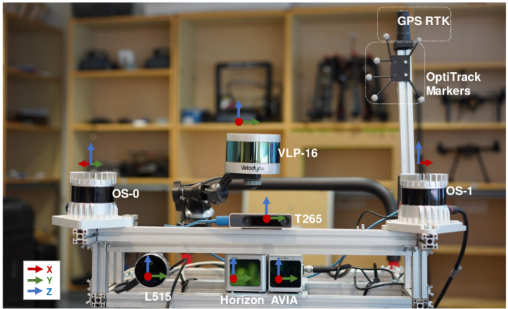

## Multi-Modal Lidars Dataset for Benchmarking General-Purpose Localization and Mapping Algorithms 

Welcome to TIERS lidars dataset! Our paper has been accepted by IEEE IROS 2022. You can check our paper [here](https://arxiv.org/pdf/2203.03454v1.pdf).

<div align=center>


</div>


<p align="left">(Left)Ground truth map for one of the indoor sequences generated based on the proposed approach (SLAM-assisted ICP-based prior map). This enables benchmarking of lidar odometry and mapping algorithms in larger environments where a motion capture system or similar is not available, with significantly higher accuracy than GNSS/RTK solutions.</p>

|  OS0  | OS1 |  Horizon  |  Avia  |  Velo  |
|  :----:  | :----:  | :----:  | :----:  | :----:  |
|    |  |  |  |  |

Our dataset was captured by a rich suite of sensors. Subsets of the data from the Indoor10 sequence are visualized here. From left to right are the lidar data of Ouster OS0, OusterOS1, Livox Horizon, Livox Avia, and Velodyne Lidar.


<p align="left">  The above images show the reflection map (top) and the range map (bottom) of Ouster OS0, respectively. The left one in the middle is the image data of L515, and the one on the right is the fisheye image data of T265. </p>


Indoor data(Calibrate Sequence) |  OpenRoad SLAM example(Road03 Sequence)
:-------------------------:|:-------------------------:
  |  
Forest SLAM example(Forest01 Sequence) |  Corridor SLAM example(Indoor10 Sequence)
  |  

The dataset is available at the [University of Turku servers]([https://utufi.sharepoint.com/:f:/s/msteams_0ed7e9/EidIYx-aBBFCgsR0pptbzHwBeNiJZSzUBtGcPMcXEXix6w?e=g18kMN](https://utufi.sharepoint.com/:f:/s/msteams_0ed7e9/Etwsa7m8hxhMk9H3x-K6DfUBgU3x-ZK9vMeD_V0J2mdHwA)). Specific links for each sequence and for the ground truth data are available in Section 3.1 of this file.

## ABSTRACT:

Lidar-based simultaneous localization and mapping (SLAM) approaches have obtained considerable success in autonomous robotic systems. This is in part owing to the high-accuracy of robust SLAM algorithms and the emergence of new and lower-cost lidar products. This study benchmarks current state-of-the-art lidar SLAM algorithms with a multi-modal lidar sensor setup showcasing diverse scanning modalities (spinning and solid-state) and sensing technologies, and lidar cameras, mounted on a mobile sensing and computing platform. We extend our previous multi-modal multi-lidar dataset with additional sequences and new sources of ground truth data. Specifically, we propose a new multi-modal multi-lidar SLAM-assisted and ICP-based sensor fusion method for generating ground truth maps. With these maps, we then match real-time pointcloud data using a natural distribution transform (NDT) method to obtain the ground truth with full 6 DOF pose estimation. This novel ground truth data leverages high-resolution spinning and solid-state lidars. We also include new open road sequences with GNSS-RTK data and additional indoor sequences with motion capture (MOCAP) ground truth, complementing the previous forest sequences with MOCAP data. We perform an analysis of the positioning accuracy achieved with ten different SLAM algorithm and lidar combinations. We also report the resource utilization in four different computational platforms and a total of five settings (Intel and Jetson ARM CPUs). Our experimental results show that current state-of-the-art lidar SLAM algorithms perform very differently for different types of sensors.

Keywords: Lidar, Dataset, Multi-modal, Multi-scenario, SLAM, Solid-state lidarsAutonomous driving, LiDAR SLAM benchmark solid-state LiDAR, SLAM

## MAIN CONTRIBUTIONS: 

   * a ground truth trajectory generation method for environments where MOCAP or GNSS/RTK are unavailable that leverages the multi-modality of the data acquisition platform and high-resolution sensors;% by solid-state lidar with a Non-repetitive scanning pattern and high-resolution spinning lidar.

* a new dataset with data from 5 different lidar sensors, one lidar camera, and one stereo fisheye cameras in a variety of environments as illustrated in [here][./imgs/intro_new.jpg] . Ground truth data is provided for all sequences; 
* the benchmarking of ten state-of-the-art filter-based and optimization-based SLAM methods on our proposed dataset in terms of the accuracy of odometry, memory and computing resource consumption. The results indicate the limitations of current SLAM algorithms and potential future research directions.


## Updates 

2022.03.01   Initial dataset upload


## 1. LICENSE

This work is licensed under the MIT license and is provided for academic purpose. Please contact us at qingqli@utu.fi for further information.  


## 2. SENSOR SETUP

### 2.1 Data acquisition platform

Physical drawings and schematics of the sensor suite is given below. The unit of the figures is centimeter.

<div align=center>

</div>
<p align="center">Our data collecting platform, front view RGB (left), top view (middle) and front view (right).</p>


### 2.2 Sensor parameters

Sensor specification for the presented dataset. Angular resolution is configurable in the OS1-64 (varying the vertical FoV). Livox lidars have a non-repetitive scan pattern that delivers higher angular resolution with longer integration times. Range is based on manufacturerinformation, with values corresponding to 80% Lambertian reflectivity and 100 klx sunlight, except for the L515  and Realsense T265 lidar camera.
<div align=center>

</div>


### 2.3 ROS topics

#### 2.3.1 Dataset based on NDT method 

The rostopics of our rosbag sequences are listed as follows:

* VLP-16 LIDAR : \
  `/velodyne_points  sensor_msgs/PointCloud2`  

* OS0 LIDAR : \
 `    /os0_cloud_node/imu             : sensor_msgs/Imu    `        
    `    /os0_cloud_node/points         :  sensor_msgs/PointCloud2    ` 
    `    /os0_img_node/nearir_image       : sensor_msgs/Image    `       
    `     /os0_img_node/range_image       : sensor_msgs/Image     `      
    `     /os0_img_node/reflec_image        : sensor_msgs/Image    `       
   
* OS1 LIDAR : \

  `/os1_cloud_node/imu             : sensor_msgs/Imu  `         
  `/os1_cloud_node/points           : sensor_msgs/PointCloud2  ` 

* Horizon LIDAR : \
  `/horizon/livox/imu       : sensor_msgs/Imu           `
  `/horizon/livox/lidar     : livox_ros_driver/CustomMsg`

* AVIA LIDAR : \
 `/avia/livox/imu        : sensor_msgs/Imu     `      
  `/avia/livox/lidar      : livox_ros_driver/CustomMsg`

* L515 LIDAR CAMERA: \
  `/l515/accel/sample              : sensor_msgs/Imu      `     
  `/l515/color/image_raw           : sensor_msgs/Image   `      
  `/l515/depth/color/points        : sensor_msgs/PointCloud2 `  
  `/l515/depth/image_rect_raw      : sensor_msgs/Image       `  
  `/l515/gyro/sample               : sensor_msgs/Imu      `     

* T265 LIDAR CAMERA: \
 `/t265/accel/sample              : sensor_msgs/Imu    `       
  `/t265/fisheye1/image_raw        : sensor_msgs/Image   `      
  `/t265/fisheye2/image_raw        : sensor_msgs/Image    `     
  `/t265/gyro/sample               : sensor_msgs/Imu        `   
  `/t265/odom/sample               : nav_msgs/Odometry   `      

#### 2.3.2 Dataset based on MOCAP or GNSS/RTK 

The rostopics of our rosbag sequences are listed as follows:

* VLP-16 LIDAR : \
  `/velodyne_points  sensor_msgs/PointCloud2`  

* OS0 LIDAR : \
  `    /os0_cloud_node/imu             : sensor_msgs/Imu    `        
   `    /os0_cloud_node/points         :  sensor_msgs/PointCloud2    ` 
   `    /os0_img_node/nearir_image       : sensor_msgs/Image    `       
   `     /os0_img_node/range_image       : sensor_msgs/Image     `      
   `     /os0_img_node/reflec_image        : sensor_msgs/Image    `       

* OS1 LIDAR : \

  `/os1_cloud_node/imu             : sensor_msgs/Imu  `         
  `/os1_cloud_node/points           : sensor_msgs/PointCloud2  ` 

* Horizon LIDAR : \
  `/horizon/livox/imu       : sensor_msgs/Imu           `
  `/horizon/livox/lidar     : livox_ros_driver/CustomMsg`

* AVIA LIDAR : \
  `/avia/livox/imu        : sensor_msgs/Imu     `      
  `/avia/livox/lidar      : livox_ros_driver/CustomMsg`

* L515 LIDAR CAMERA: \
  `/l515/accel/sample              : sensor_msgs/Imu      `     
  `/l515/color/image_raw           : sensor_msgs/Image   `      
  `/l515/depth/color/points        : sensor_msgs/PointCloud2 `  
  `/l515/depth/image_rect_raw      : sensor_msgs/Image       `  
  `/l515/gyro/sample               : sensor_msgs/Imu      `     
  
* T265 LIDAR CAMERA: \
  `/t265/accel/sample              : sensor_msgs/Imu    `       
   `/t265/fisheye1/image_raw        : sensor_msgs/Image   `      
   `/t265/fisheye2/image_raw        : sensor_msgs/Image    `     
   `/t265/gyro/sample               : sensor_msgs/Imu        `   
   `/t265/odom/sample               : nav_msgs/Odometry   `     
  
* MOCAP SYSTEM:
  `/vrpn_client_node/optitest/pose : geometry_msgs/PoseStamped`
  
* GNSS/RTK: \

    `/mavros/global_position/global          : sensor_msgs/NavSatFix    ` 
    `/mavros/global_position/local           : nav_msgs/Odometry         `
    `/mavros/global_position/raw/fix         : sensor_msgs/NavSatFix     `
    `/mavros/global_position/raw/gps_vel     : geometry_msgs/TwistStamped`
    `/mavros/global_position/raw/satellites  : std_msgs/UInt32           `
    `/mavros/imu/data                        : sensor_msgs/Imu           `
    `/mavros/imu/mag                         : sensor_msgs/MagneticField `
    `/mavros/local_position/odom             : nav_msgs/Odometry  `


## 3. DATASET SEQUENCES

<div align=center>

<p align="center">List of data sequences in our dataset </p>
 
</div>


### 3.1 Main dataset

Sequence Name|Collection Date|Total Size|Duration|Features|Rosbag|GroundTruth
--|:--|:--:|--:|--:|--:|--:
Indoor06|2022-08-10|19.7g|64s|day,indoor,office|[Rosbag](https://utufi.sharepoint.com/sites/msteams_0ed7e9/Shared%20Documents/Forms/AllItems.aspx?ga=1&id=%2Fsites%2Fmsteams%5F0ed7e9%2FShared%20Documents%2FDatasets%2FTIERS%5FMulti%5FLidar%5FDataset%5FEnhanced%2Fdata%5Fnarnia%5Feasy%5F2022%2D06%2D07%2D19%2D11%2D38%2Ebag&parent=%2Fsites%2Fmsteams%5F0ed7e9%2FShared%20Documents%2FDatasets%2FTIERS%5FMulti%5FLidar%5FDataset%5FEnhanced)| SLAM+ICP [link](./data/ground_truth/GT_indoor06.csv) 
Indoor07|2022-07-16|22.4g|73s|day,indoor,office| [Rosbag](https://utufi.sharepoint.com/sites/msteams_0ed7e9/Shared%20Documents/Forms/AllItems.aspx?ga=1&id=%2Fsites%2Fmsteams%5F0ed7e9%2FShared%20Documents%2FDatasets%2FTIERS%5FMulti%5FLidar%5FDataset%5FEnhanced%2Fdata%5Fnarnia%5Fhard%5F2022%2D06%2D07%2D19%2D13%2D08%2Ebag&parent=%2Fsites%2Fmsteams%5F0ed7e9%2FShared%20Documents%2FDatasets%2FTIERS%5FMulti%5FLidar%5FDataset%5FEnhanced)|SLAM+ICP [link](./data/ground_truth/GT_indoor07.csv)
Indoor08|2022-07-05|33.1g|89s|day,indoor,office|[Rosbag](https://utufi.sharepoint.com/sites/msteams_0ed7e9/Shared%20Documents/Forms/AllItems.aspx?ga=1&id=%2Fsites%2Fmsteams%5F0ed7e9%2FShared%20Documents%2FDatasets%2FTIERS%5FMulti%5FLidar%5FDataset%5FEnhanced%2Fdata%5Flab%5Fspace%5F2022%2D06%2D07%2D18%2D56%2D52%2Ebag&parent=%2Fsites%2Fmsteams%5F0ed7e9%2FShared%20Documents%2FDatasets%2FTIERS%5FMulti%5FLidar%5FDataset%5FEnhanced)| SLAM+ICP [link](./data/ground_truth/GT_indoor08.csv)
Indoor09|2022-07-11|48.7g|168s|day,indoor,corridor|[Rosbag](https://utufi.sharepoint.com/sites/msteams_0ed7e9/Shared%20Documents/Forms/AllItems.aspx?ga=1&id=%2Fsites%2Fmsteams%5F0ed7e9%2FShared%20Documents%2FDatasets%2FTIERS%5FMulti%5FLidar%5FDataset%5FEnhanced%2Fdata%5F6th%5Ffloor%5F2022%2D06%2D07%2D18%2D32%2D02%2Ebag&parent=%2Fsites%2Fmsteams%5F0ed7e9%2FShared%20Documents%2FDatasets%2FTIERS%5FMulti%5FLidar%5FDataset%5FEnhanced)|SLAM+ICP [link](./data/ground_truth/GT_indoor09.csv)  
Indoor10|2022-06-07|43.0g|121s|day,indoor,corridor|[Rosbag](https://utufi.sharepoint.com/sites/msteams_0ed7e9/Shared%20Documents/Forms/AllItems.aspx?ga=1&id=%2Fsites%2Fmsteams%5F0ed7e9%2FShared%20Documents%2FDatasets%2FTIERS%5FMulti%5FLidar%5FDataset%5FEnhanced%2Fdata%5F3th%5Ffloor%5F2022%2D06%2D07%2D18%2D47%2D20%2Ebag&parent=%2Fsites%2Fmsteams%5F0ed7e9%2FShared%20Documents%2FDatasets%2FTIERS%5FMulti%5FLidar%5FDataset%5FEnhanced)|SLAM+ICP [link](./data/ground_truth/GT_indoor10.csv)  
Indoor11|2021-06-06|79.5g|237s|day,indoor,hall|[Rosbag](https://utufi.sharepoint.com/sites/msteams_0ed7e9/Shared%20Documents/Forms/AllItems.aspx?ga=1&id=%2Fsites%2Fmsteams%5F0ed7e9%2FShared%20Documents%2FDatasets%2FTIERS%5FMulti%5FLidar%5FDataset%5FEnhanced%2Fdata%5F1th%5Ffloor%2Ebag&parent=%2Fsites%2Fmsteams%5F0ed7e9%2FShared%20Documents%2FDatasets%2FTIERS%5FMulti%5FLidar%5FDataset%5FEnhanced)|SLAM+ICP [link](./data/ground_truth/GT_indoor11.csv)
Road3|2022-06-17|44.0g|146s|summer,outdoor,road|[Rosbag](   )|GNSS/RTK  [link](./data/ground_truth/GT_road03.csv)  
Forest01|2022-02-08|21.9g|62s|Winter,night,Square|[Rosbag](   )|MOCAP [link](./data/ground_truth/GT_opti_forest01.csv) 
Forest02|2022-02-08|22.4g|73s|Winter,night,Straight|[Rosbag](   )|MOCAP  [link](./data/ground_truth/GT_opti_forest02.csv) 

* There are also previous datasets, please check [here](https://github.com/TIERS/tiers-lidars-dataset)

### 3.2 Ground Truth:
The meaning of each column in ground truth files is as follows:  
~~~
timestamp, pose.position.x,  pose.position.y,  pose.position.z, roll, pitch, yaw, pose.orientation.x, pose.orientation.y, pose.orientation.z, pose.orientation.w. 
~~~

In the MOCAP system available environment, the ground truth data from the MOCAP system are recorded in rosbag. The user can generate the ground truth file by himself. A Script named 'result_sub_ros.py' is provided in the scripts folder to record the result and save it into a CSV file.
~~~
python2 result_sub_ros.py
~~~

### 3.3 Other data

Sequence Name|Collection Date|Total Size|Duration|Features|Rosbag 
--|:--|:--:|--:|--:|--:
LidarsCali|2022-02-11|21.9g|19.1s|room| [Rosbag](https://utufi.sharepoint.com/:u:/s/msteams_0ed7e9/Ea0qTMxHxR5GsHMX62HRjFMBxpdrOrp9fMSfKkxp2e5DAg?e=HmjOoT)

### 3.4 time delay of dataset

<div align=center>

<p align="center">The graph shows the change in the yaw value of the IMU of each lidar in the dataset. It can be seen from the picture that the average time offset of the dataset does not exceed 5ms.</p>
</div>

## 4. SLAM RESULTS 

We teseted some well-known lidar SLAM methods, which are listed below:

* [LeGO-LOAM](https://github.com/RobustFieldAutonomyLab/LeGO-LOAM)

* [FAST_LIO](https://github.com/hku-mars/FAST_LIO)

* [LIO_LIVOX](https://github.com/Livox-SDK/LIO-Livox)
* [LILI-OM](https://github.com/KIT-ISAS/lili-om)
* [LIVOX_MAPPING](https://github.com/Livox-SDK/livox_mapping)


### 4.1 Mapping quality results

<div align=center>

<p align="center">Qualitative comparison of the mapping quality. Top row showm the rgb image, fisheye image ,map LIOL Horizon, Livox_Mapping Horizon. Bottom row shows  mapping result from OS0-based FLIO, OS1-based FLIO, Velodye-based FLIO, Avis-based FLIO, and Horizon-based FLIO, and Velodyne's LeGo-LOAM maps, respectively.</p>
</div>


### 4.2 Trajectory results
<div align=center>

</div>
<div align=center>

</div>

### 4.3 Run-time evaluation across certain computing platforms

<div align=center>

</div>

## 5. DEVELOPMENT TOOLKITS 
### 5.1 Frame_ID reset

Rosbag recoreds message with their raw frame_id. If user need to show or run multiple lidar same time, we use [srv_tools](https://github.com/srv/srv_tools) to change frame_id of each topics. To install srv_tools, please follow [srv_tools installation](https://wiki.ros.org/srv_tools).

Then follow the commands below:
~~~
cd ./scripts/                                              # Go to scripts folder
python2  change_frameid.py [inbag_path] [outbag_path]      # Specify bag path
~~~

Note: This script will transform the raw frame_id to new one(right) as based on topic(left) follows:
~~~

"/avia/livox/lidar"      -> "avia_frame"
"/avia/livox/imu"        -> "avia_frame" 
"/livox/imu"             -> "horizon_frame" 
"/livox/lidar"           -> "horizon_frame" 
"/os_cloud_node/points"  -> "os0_sensor" 
"/os_cloud_node/imu"     -> "os0_imu"
"/os_cloud_nodee/points" -> "os1_sensor"
"/os_cloud_nodee/imu"    -> "os1_imu"  

~~~

### 5.2 Visulize Data

### 5.2.1 **Ubuntu** and **ROS**

Ubuntu 64-bit 16.04 or 18.04.
ROS Kinetic or Melodic. [ROS Installation](http://wiki.ros.org/ROS/Installation) and its additional ROS pacakge:

```
    sudo apt-get install ros-${ROS_DISTRO}-cv-bridge ros-${ROS_DISTRO}-tf ros-${ROS_DISTRO}-message-filters ros-${ROS_DISTRO}-image-transport
```

**NOTE** You need to source your ROS installation for the `$ROS_DISTRO` env variable to be defined. For example, if your use ROS-melodic, the command should be:

```
    sudo apt-get install ros-melodic-cv-bridge ros-melodic-tf ros-melodic-message-filters ros-melodic-image-transport
```

### 5.2.2 **PCL**

Follow [PCL Installation](http://www.pointclouds.org/downloads/linux.html).

### 5.2.3 **LiVOX ROS Driver**

To visualize data, we need install the Livox LiDAR SDK. Follow instructions [Livox-ros-driver installation](https://github.com/Livox-SDK/livox_ros_driver) 

### 5.2.4 **Download and compile this package**

~~~
cd ~/catkin_ws/src
git clone git@github.com:TIERS/multi-lidar-dataset.git
cd ..
catkin_make -DCATKIN_WHITELIST_PACKAGES="dataset_tools"
source /devel/setup.bash
~~~

Finally, we can visulize all data by
~~~
roslaunch dataset_tools data_show.launch
~~~


### 5.3 Evaluation

We use open-source tool [evo](https://github.com/MichaelGrupp/evo) for evalutation. 

To evaluate LIDAR SLAM, you can run: 
~~~
evo_ape tum optk.txt {SLAM_result}.txt -a -p
~~~

### 5.4 Calibration 

## Lidars Extrinsic
We provide a tool for extrinsic parameters between lidars that can calculate the extrinsic parameter based on GICP methods. As the OS0 has the highest FOV, we first rotate the coordinate of OS0 sensor 45 degrees to align its X-axis with Horizon, Avia and Velodyne. Then the rotated coordinate is treated as "base_link". All clouds from other lidar are matched with the "base_link" coordinate. For Avia, Horizon, we integrated the first five frames to increase point cloud density and reduce its low FOV impact.

To use this tools, first play one rosbag from our dataset:
~~~
rosbag play  ICT_OUT_2022-02-20-17-34-49.bag --clock
~~~
Then run our calibration launch file:
~~~
roslaunch dataset_tools lidars_extri_comp.launch
~~~

Then you can find the calculated parameter, and its transformed cloud;
~~~
OS0 -> base_link 0 0 0 0.785398       -0        0 /os0_sensor /base_link 10
OS1 -> base_link  0.0100882   0.581502 -0.0210581  2.34826  3.12619 -3.13066 /os1_sensor /base_link 10
velo -> base_link -0.164831  0.173188  0.117624 3.07795 3.09161 3.12807 /velo_sensor /base_link 10
Avia -> base_link -0.0608374    0.29663  -0.122276  0.00549421 0.000246092   -0.011555 /avia_frame /base_link 10
hori -> base_link 0.00345477   0.145195  -0.134907 3.12905 3.14022 3.12706 /hori_frame /base_link 10
~~~

The RVIZ window will be opened and show the aligned point cloud.
<div align=left>


## IMU 
For IMU intrinsics, visit [Imu_utils](https://github.com/gaowenliang/imu_utils)

For extrinsics between cameras and LIVOX Lidar, visit [livox_camera_lidar_calibration](https://github.com/Livox-SDK/livox_camera_lidar_calibration)  

### 5.5 Sensor details and datasheets

[Avia](https://www.livoxtech.com/avia): https://www.livoxtech.com/avia,  
[Horizon](https://www.livoxtech.com/horizon):https://www.livoxtech.com/horizon,  
[OS0](https://ouster.com/products/scanning-lidar/os0-sensor/):https://ouster.com/products/scanning-lidar/os0-sensor/,    
[OS1](https://ouster.com/products/scanning-lidar/os1-sensor/):https://ouster.com/products/scanning-lidar/os1-sensor/,   
[Vlp-16](https://velodynelidar.com/products/puck/):https://velodynelidar.com/products/puck/,     
[Realsense L515](https://www.intelrealsense.com/lidar-camera-l515/):https://www.intelrealsense.com/lidar-camera-l515/.

<!-- # Star History

[](https://star-history.com/#TIERS/tiers-lidars-dataset&Date) -->

## 6. ACKNOWLEGEMENT

This research work is supported by the Academy of Finland's AeroPolis project (Grant 348480) and the Finnish Foundation for Technology Promotion (Grants 7817 and 8089).

Please cite our [*Dataset* paper](https://arxiv.org/pdf/2203.03454v1.pdf) if the code or data in this repo helps your work: 
```
@article{li2022dataset,
  title={Multi-Modal Lidar Dataset for Benchmarking General-Purpose Localization and Mapping Algorithms},
  author={ Li, Qingqing and  Yu, Xianjia and Pe{\~n}a Queralta, Jorge and Westerlund, Tomi},
  journal={arXiv preprint arXiv:2203.03454},
  year={2022}
}

```


[./imgs/intro_new.jpg]: 
